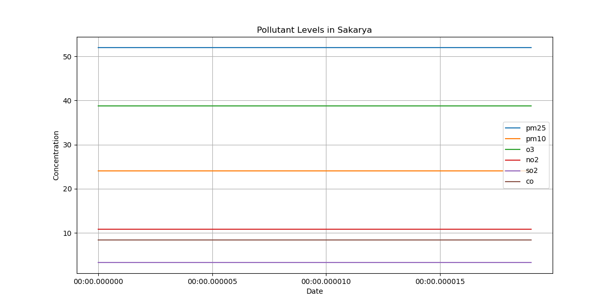
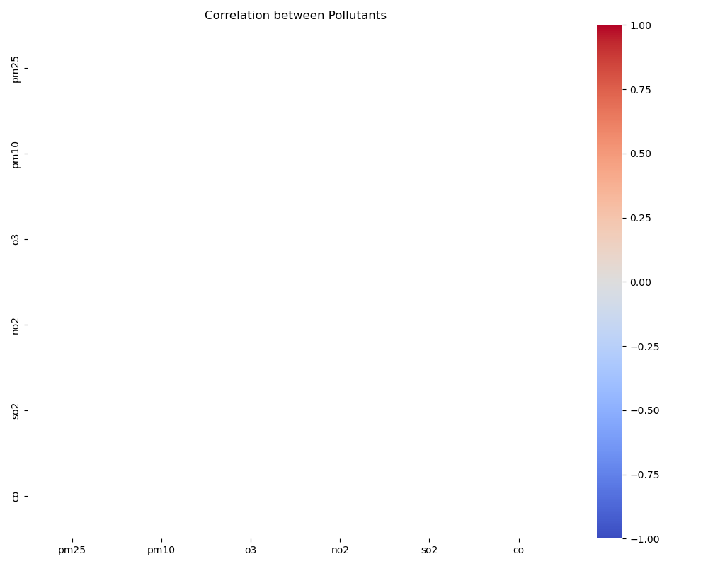

# Sakarya Air Quality Analysis Report

## Basic AQI Statistics
```
count    20.0
mean     52.0
std       0.0
min      52.0
25%      52.0
50%      52.0
75%      52.0
max      52.0
Name: aqi, dtype: float64
```

## Raw Data
```
                               city  aqi  iaqi_co  iaqi_dew  iaqi_h  iaqi_no2  iaqi_o3  iaqi_p  iaqi_pm10  iaqi_pm25  iaqi_so2  iaqi_t  iaqi_w
timestamp                                                                                                                                     
2024-08-14 20:10:09.866959  Sakarya   52      8.4        18      88      10.8     38.8    1011         24         52       3.3      20       1
2024-08-14 20:10:39.871947  Sakarya   52      8.4        18      88      10.8     38.8    1011         24         52       3.3      20       1
2024-08-14 20:11:09.877931  Sakarya   52      8.4        18      88      10.8     38.8    1011         24         52       3.3      20       1
2024-08-14 20:11:39.882998  Sakarya   52      8.4        18      88      10.8     38.8    1011         24         52       3.3      20       1
2024-08-14 20:12:09.889250  Sakarya   52      8.4        18      88      10.8     38.8    1011         24         52       3.3      20       1
2024-08-14 20:12:39.894603  Sakarya   52      8.4        18      88      10.8     38.8    1011         24         52       3.3      20       1
2024-08-14 20:13:09.899771  Sakarya   52      8.4        18      88      10.8     38.8    1011         24         52       3.3      20       1
2024-08-14 20:13:39.904969  Sakarya   52      8.4        18      88      10.8     38.8    1011         24         52       3.3      20       1
2024-08-14 20:14:09.910187  Sakarya   52      8.4        18      88      10.8     38.8    1011         24         52       3.3      20       1
2024-08-14 20:14:39.915049  Sakarya   52      8.4        18      88      10.8     38.8    1011         24         52       3.3      20       1
2024-08-14 20:15:09.921138  Sakarya   52      8.4        18      88      10.8     38.8    1011         24         52       3.3      20       1
2024-08-14 20:15:39.926630  Sakarya   52      8.4        18      88      10.8     38.8    1011         24         52       3.3      20       1
2024-08-14 20:16:09.932117  Sakarya   52      8.4        18      88      10.8     38.8    1011         24         52       3.3      20       1
2024-08-14 20:16:39.938660  Sakarya   52      8.4        18      88      10.8     38.8    1011         24         52       3.3      20       1
2024-08-14 20:17:09.944095  Sakarya   52      8.4        18      88      10.8     38.8    1011         24         52       3.3      20       1
2024-08-14 20:17:39.949499  Sakarya   52      8.4        18      88      10.8     38.8    1011         24         52       3.3      20       1
2024-08-14 20:18:09.954847  Sakarya   52      8.4        18      88      10.8     38.8    1011         24         52       3.3      20       1
2024-08-14 20:18:39.960614  Sakarya   52      8.4        18      88      10.8     38.8    1011         24         52       3.3      20       1
2024-08-14 20:19:09.966113  Sakarya   52      8.4        18      88      10.8     38.8    1011         24         52       3.3      20       1
2024-08-14 20:19:39.970770  Sakarya   52      8.4        18      88      10.8     38.8    1011         24         52       3.3      20       1
```

## Visualizations
### AQI Values


### Pollutant Levels

### AQI Decomposition

### Pollutant Correlation

